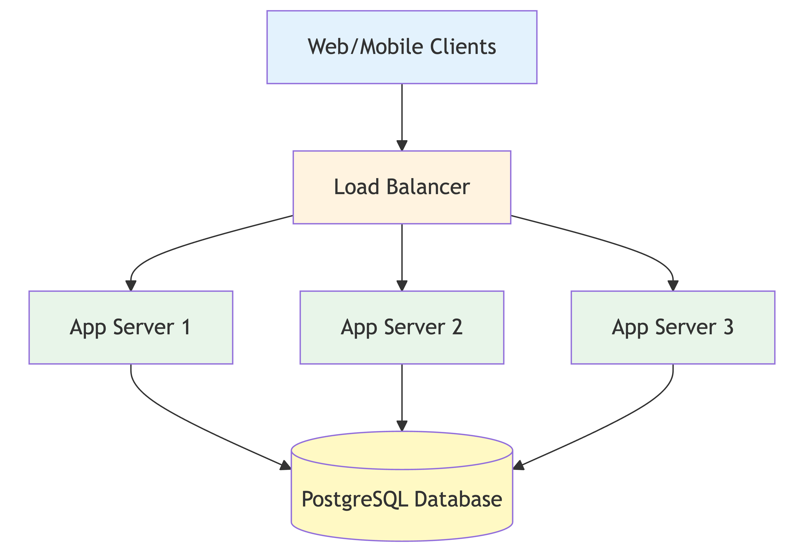
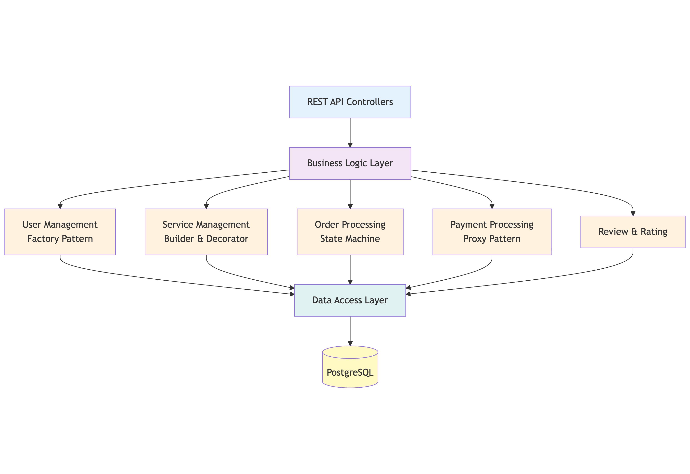
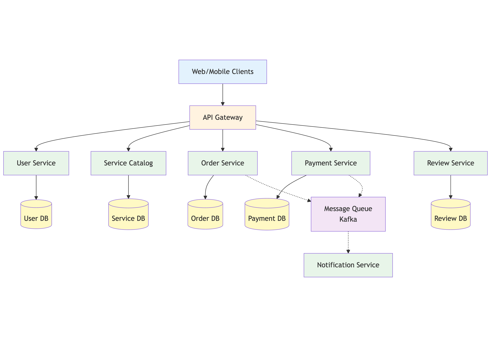
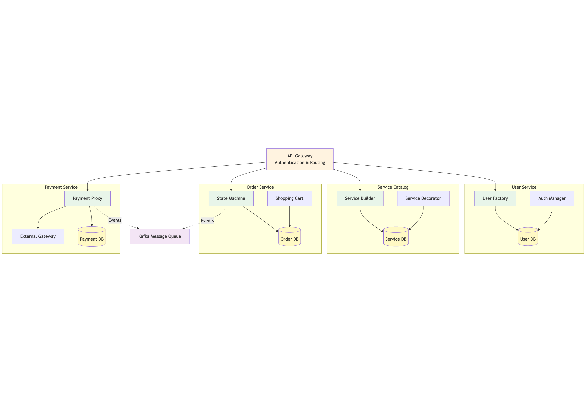

# Milestone 3: Software Architecture Analysis for SkillSphere

**Students:** Istudor Victor-Mihai, Țigăeru Septimiu-Mihai  
**Course:** 1241EA  
**Date:** November 2025

---

## 1. Monolithic Architecture

### 1.1 Description

A monolithic architecture implements SkillSphere as a single, unified application where all components are tightly integrated within one codebase and deployed as a single unit.

**Key Components:**
- **Presentation Layer**: Web controllers handling HTTP requests
- **Business Logic**: 
  - User Management (Factory pattern for Buyer/Seller creation)
  - Service Management (Builder pattern for complex listings, Decorator for tiers)
  - Order Processing (state machine for order lifecycle)
  - Payment Processing (Proxy pattern for gateway integration)
  - Review & Rating System
- **Data Layer**: Single PostgreSQL database with all tables (users, services, orders, payments, reviews)

**Data Flow Example (Order Purchase):**
```
Buyer → Controller → Order Service → Payment Proxy → External Gateway → Database → Response
```

### 1.2 Architecture Diagrams

**Deployment Diagram:**


**Component Diagram:**


### 1.3 Pros and Cons

**Advantages:**
- **Simple Development**: Single codebase, easy to understand and navigate
- **Easy Testing**: End-to-end tests are straightforward
- **Simple Deployment**: One application to deploy, easy rollback
- **Strong Consistency**: ACID transactions across all operations
- **Low Operational Overhead**: One app server + one database to manage
- **Perfect for Small Team**: 2 developers can be highly productive
- **Fast Time to Market**: Quickest path to MVP

**Disadvantages:**
- **Scaling Limitations**: Must scale entire application even if only one module needs it
- **Technology Lock-in**: Entire app must use same language/framework
- **Single Point of Failure**: One bug can crash the entire application
- **Deployment Risk**: Every deployment risks the whole system
- **Long-term Maintenance**: As codebase grows, becomes harder to maintain

**SkillSphere-Specific Considerations:**
- Perfect for initial launch with 2 developers
- Can handle first 1,000-10,000 users easily
- Payment transactions benefit from ACID guarantees
- Simple infrastructure keeps costs low initially

---

## 2. Microservices Architecture

### 2.1 Description

Microservices decompose SkillSphere into independent services, each responsible for a specific business capability and owning its data.

**Key Services:**
- **User Service**: Authentication, user profiles (Factory pattern)
- **Service Catalog Service**: Listings, search (Builder & Decorator patterns)
- **Order Service**: Order management, shopping cart
- **Payment Service**: Payment processing (Proxy pattern)
- **Review Service**: Reviews, ratings, reputation
- **Notification Service**: Emails, push notifications
- **API Gateway**: Single entry point, routing, authentication

**Communication:**
- Synchronous: REST APIs for critical operations
- Asynchronous: Message queue (RabbitMQ/Kafka) for notifications and eventual consistency

### 2.2 Architecture Diagrams

**Deployment Diagram:**


**Component Diagram:**


### 2.3 Pros and Cons

**Advantages:**
- **Independent Scaling**: Scale only the services that need it
- **Technology Flexibility**: Different services can use different tech stacks
- **Fault Isolation**: Failure in one service doesn't crash others
- **Independent Deployment**: Deploy services separately, lower risk
- **Team Autonomy**: Different teams can own different services
- **Optimized Databases**: Each service chooses best database for its needs

**Disadvantages:**
- **High Complexity**: Service discovery, API gateway, distributed tracing needed
- **Network Latency**: Every inter-service call goes over network
- **Eventual Consistency**: No ACID transactions across services
- **Testing Complexity**: Need to test service interactions
- **Operational Overhead**: Multiple services, databases, and logs to manage
- **Initial Development Slower**: Infrastructure setup takes time
- **Team Size Mismatch**: Overhead too high for 2 developers

**SkillSphere-Specific Considerations:**
- Too complex for 2-person team initially
- Makes sense when team grows to 5+ developers
- Allows scaling Service Catalog independently during peak browsing
- Payment Service isolation improves security

---

## 3. Event-Driven Architecture

### 3.1 Description

Event-Driven Architecture centers around events (facts about what happened). Services publish events when something occurs and consume events to react to changes. For SkillSphere, this naturally maps to marketplace workflows.

**Core Components:**
- **Event Bus (Kafka)**: Central communication backbone
- **Services**: Produce and consume events
  - User Service (publishes: UserRegistered)
  - Service Catalog (publishes: ServiceListed)
  - Order Service (publishes: OrderPlaced, OrderCompleted)
  - Payment Service (publishes: PaymentCompleted)
  - Review Service (publishes: ReviewSubmitted)
  - Notification Service (consumes all events for notifications)
  - Analytics Service (consumes all events for insights)

**Event Flow Example (Order Purchase):**
```
1. Buyer places order → Order Service publishes "OrderPlaced"
2. Payment Service consumes "OrderPlaced" → processes payment
3. Payment Service publishes "PaymentCompleted"
4. Order Service consumes "PaymentCompleted" → updates order status
5. Order Service publishes "OrderConfirmed"
6. Notification Service consumes "OrderConfirmed" → sends notifications
7. Service Catalog consumes "OrderConfirmed" → updates purchase count
```

### 3.2 Architecture Diagrams

**Deployment Diagram:**


**Component Diagram with Event Flow:**


### 3.3 Pros and Cons

**Advantages:**
- **Extreme Loose Coupling**: Services don't know about each other
- **Asynchronous Processing**: Non-blocking, better performance
- **Fault Tolerance**: Events persisted in Kafka, no data loss
- **Event Replay**: Can reprocess events for debugging or fixing bugs
- **Natural Fit for Marketplace**: Order workflows map perfectly to events
- **Easy to Add Features**: New services just subscribe to events
- **Scalability**: Each consumer scales independently
- **Audit Trail**: All events logged for compliance

**Disadvantages:**
- **Eventual Consistency**: Data not immediately consistent across services
- **High Complexity**: Kafka cluster, schema management, distributed tracing
- **Difficult Debugging**: Must trace events through multiple services
- **Event Schema Management**: Changes require careful versioning
- **Testing Challenges**: Asynchronous nature makes testing harder
- **Operational Overhead**: Kafka cluster requires expertise
- **Learning Curve**: Team must understand distributed systems and Kafka
- **Higher Cost**: Kafka infrastructure adds expense

**SkillSphere-Specific Considerations:**
- Perfect fit for marketplace workflows (order → payment → notification → review)
- Better than pure microservices for SkillSphere's event-driven nature
- Enables real-time analytics (revenue, popular services, seller performance)
- Complex for initial launch but ideal long-term architecture

---

## 4. Comparative Analysis

### 4.1 Key Trade-offs

**Monolithic vs Microservices:**
- Monolithic: Simpler but less flexible
- Microservices: More complex but scales better
- For 2-person team: Monolithic wins initially

**Microservices vs Event-Driven:**
- Microservices: Synchronous coupling between services
- Event-Driven: Asynchronous, looser coupling, better for workflows
- For marketplace: Event-Driven better fits order → payment → notification flows

**Consistency Trade-offs:**
- Monolithic: Strong consistency is easier for payments/orders
- Event-Driven: Eventual consistency requires careful UX design (loading states, confirmations)

### 4.2 SkillSphere-Specific Scenarios

**Scenario 1: High Traffic on Service Browsing**
- Monolithic: Must scale entire app 
- Microservices: Scale only Service Catalog service 
- Event-Driven: Scale Service Catalog service 

**Scenario 2: Payment Processing Bug**
- Monolithic: Bug can crash entire site 
- Microservices: Payment service fails, others still work 
- Event-Driven: Payment service fails, others still work, events queued 

**Scenario 3: Adding Real-time Analytics**
- Monolithic: Must modify codebase, add queries that slow down app 
- Microservices: Need to add API calls to all services 
- Event-Driven: Just add Analytics service consuming all events 

---

## 5. Conclusion

For SkillSphere, the optimal architecture is **Monolithic initially, evolving to Event-Driven Microservices**. This approach:

 ~ Enables fast MVP launch with the small team  
 ~ Keeps costs and complexity low initially  
 ~ Provides strong consistency for critical transactions  
 ~ Prepares for scale through phased evolution  
 ~ Matches marketplace workflows long-term  


